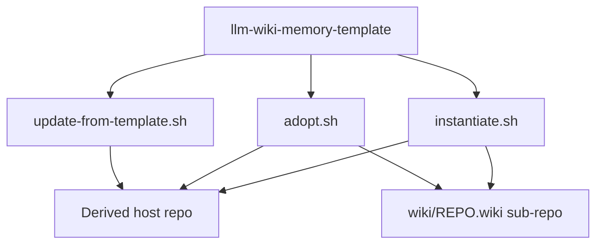

# TIMELINE — internal process documentation

Audience: maintainers and operators who need the mechanical pipeline (scripts, copies, stamps, commits). User-facing how-to lives in [README.md](README.md). This file mirrors **current script behavior**; where something is refused or incomplete, it is marked **Not implemented**.

Canonical allowlist of template-owned files: [scripts/lib/template-manifest.sh](scripts/lib/template-manifest.sh). Adopt, update, and check all assemble their working sets from that manifest. Instantiation uses an inlined cousin of the same lists (substitutions + prune logic) rather than sourcing the assembler.

---

## Background

This repository templates the **wiki-as-memory** pattern: a durable, LLM-maintained wiki (separate git repo) plus optional agent overlays that teach Claude Code, Cursor, or a future assistant to Query / Ingest / Lint against it.

A host project gets the pattern in one of two ways:

1. **Instantiate** — new repo created from this template; [scripts/instantiate.sh](scripts/instantiate.sh) bootstraps in place and self-deletes.
2. **Adopt** — existing repo; run [scripts/adopt.sh](scripts/adopt.sh) from a local clone of this template (additive ADD + TOUCH grants).

After either path, **ongoing sync** is [scripts/update-from-template.sh](scripts/update-from-template.sh). Overlay choice at bootstrap and later overlay landing / refresh are separate concerns (see §3).



---

## 1. Create project from template (`instantiate.sh`)

### Prerequisites

- Repo tree is a clone / GitHub “Use this template” copy of this repository.
- No root `CLAUDE.md` yet (script exits if present).
- `CLAUDE.md.template` present.
- Optional `--features=<csv>`: each name must have `features/<name>/feature.json` (validated before any writes).
- Optional `--github-wiki`: `origin` remote set; GitHub Wiki often requires a first UI page before `<repo>.wiki.git` exists (see Path A).

### Entry invocation

```bash
./scripts/instantiate.sh "<Project Name>" \
  [--agent=none|claude-code|cursor|all] \
  [--description="..."] \
  [--github-wiki] \
  [--features=<csv>]
```

Default `--agent=claude-code`. Alternate contributor path: `./scripts/instantiate.sh --dev-self` (Path C).

Resolve identity once: `lw_repo_root` → `lw_name_from_origin` → `REPO_NAME` / `OWNER`. That name is passed to `wiki/init-wiki.sh --repo-name` (not re-derived inside init).

---

### Path A — GitHub Wiki backend (`--github-wiki`)

1. User activates GitHub Wiki (often required): open `<repo>/wiki` → create first `Home` page. Without this, seed-push / clone return 404.
2. Script derives wiki URL from `origin` via `lw_wiki_url`.
3. Optional: `gh api repos/<slug> -X PATCH -F has_wiki=true`.
4. If `git ls-remote` on the wiki URL fails: temp repo + seed `Home.md` + push to `master`. On failure, **instantiate exits** with UI workaround (unlike adopt, which falls back to local). Caller may need `rm CLAUDE.md` before re-run (script may have already written it).
5. `wiki/init-wiki.sh --repo-name "$REPO_NAME" --github` [optional `--agent` when agent is `claude-code` or `cursor`].

### Path B — local-only wiki (no `--github-wiki`)

1. `wiki/init-wiki.sh --repo-name "$REPO_NAME"` (no `--github`): `git init` under `wiki/<REPO_NAME>.wiki/`.

### Path C — `--dev-self` (template contributors only)

Short-circuits the normal flow. Does **not** call `init-wiki.sh`, does **not** delete `CLAUDE.md.template`, does **not** rewrite `.claude/commands|skills`, does **not** self-delete.

1. Require manual clone: `wiki/llm-wiki-memory-template.wiki/`.
2. Write / refresh block in `.git/info/exclude` for `/CLAUDE.md`, wiki clone, `.claude/settings.json`, `.claude/hooks/`.
3. Render `CLAUDE.md` from template (keep `.template` on disk).
4. `wiki/agents/claude-code/setup.sh --hook --posttooluse-hook`.
5. Exit 0.

---

### Normal-path ordered phases (A or B)

| Step | Actor | What happens |
|------|--------|----------------|
| 1 | `instantiate.sh` | Stamp `CLAUDE.md.template` → `CLAUDE.md` (`{{PROJECT_NAME}}`, `{{REPO_NAME}}`, `{{DESCRIPTION}}`, `{{AGENT_NOTE}}`); **delete** `.template`. |
| 2 | | Stamp `README.md.template` → `README.md` (`{{PROJECT_NAME}}`, `{{REPO_NAME}}`, `{{OWNER}}`, `{{DESCRIPTION}}`); delete `.template`. Overwrites the template’s own README. |
| 3 | | Remove template-dev-only `.claude/rules/observe-the-failure.md`; rmdir `.claude/rules` if empty. |
| 4 | Path A/B above | Bootstrap wiki (skip entire init if `wiki/${REPO_NAME}.wiki` already exists). |
| 5 | | If no `scripts/kg/`, strip `### Knowledge Graph` subsection from `CLAUDE.md`. |
| 6 | Overlay keep/prune | See table below. |
| 7 | Optional | `install_feature` for each `--features=` name. |
| 8 | | Print checklist; **`rm -f scripts/instantiate.sh`** (one-shot). |

Script does **not** commit the main repo. Wiki seed is auto-committed inside the wiki sub-repo by `init-wiki.sh`.

---

### What `init-wiki.sh` creates / stamps

Under `wiki/<REPO_NAME>.wiki/` (separate git repo):

- `Home.md` (redirect), `Home_<REPO>.md`, `index_<REPO>.md`, `log_<REPO>.md`, `SCHEMA_<REPO>.md`
- Every `wiki/*.md.template` stamped → wiki page with `.template` stripped (today: `Edge-Types.md.template` → `Edge-Types.md`), substituting `{{REPO_NAME}}` / `{{PROJECT_NAME}}`
- Auto-commit e.g. `"Initialize wiki with llm-wiki pattern (namespaced)"`

May also patch / seed root `CLAUDE.md` sections when running create/update modes (adopt relies on this for absent `CLAUDE.md`).

---

### Per-`--agent` keep / prune / setup

| `--agent` | Keep | Delete | Substitutions | Base `setup.sh` |
|-----------|------|--------|---------------|-----------------|
| `claude-code` | `.claude/`, `wiki/agents/claude-code/` | `.cursor/`, `.cursorrules.template`, `.cursorignore.template`, `wiki/agents/cursor/` | `{{REPO_NAME}}` in `.claude/commands/wiki-*.md`, `.claude/skills/wiki-*.md`; `settings.json.template` → `settings.json` | `wiki/agents/claude-code/setup.sh` |
| `cursor` | `.cursor/`, `wiki/agents/cursor/` | `.claude/`, `wiki/agents/claude-code/`, `.cursorignore.template` (after stamping) | `{{REPO_NAME}}` in `.cursor/rules/wiki-*.mdc`, `.cursor/skills/wiki-*/SKILL.md`; stamp `.cursorignore.template` → `.cursorignore` (verbatim; not overwritten if present) | `wiki/agents/cursor/setup.sh` |
| `all` | both overlays | neither overlay tree; `.cursorignore.template` (after stamping) | both substitution passes; stamp `.cursorignore.template` → `.cursorignore` | both `setup.sh` base |
| `none` | neither overlay | `.claude/`, `.cursor/`, both `wiki/agents/{claude-code,cursor}/`, `.cursorrules.template`, `.cursorignore.template` | none | none |

**Hooks are not installed** on the normal instantiate path. Base `setup.sh` verifies artefacts / injects CLAUDE.md sentinels (Claude). Optional later: Claude `--hook` / `--posttooluse-hook` / `--seed-memory` / `--all`; Cursor `--hook` / `--legacy` / `--all`.

`INIT_AGENT_ARGS`: only when agent is exactly `claude-code` or `cursor` (not `all` / `none`), forwarded to init-wiki for log attribution.

---

### Main vs wiki commits after instantiate

| Repo | Who commits | What |
|------|-------------|------|
| Main project | User | Generated `CLAUDE.md`, `README.md`, kept overlays, settings, features state, etc. (`instantiate.sh` is gone) |
| `wiki/<REPO>.wiki/` | `init-wiki.sh` | Seed pages |
| Wiki remote push | User | Path A only: `git -C wiki/<repo>.wiki push -u origin master` |

---

## 2. Adopt into an existing project (`adopt.sh`)

Run from a **separate** clone of the template against a host git repo that is **not** the template root.

```bash
bash /path/to/llm-wiki-memory-template/scripts/adopt.sh \
  --target=/path/to/host \
  [--apply] \
  [--agent=claude-code|none|cursor] \
  [--github-wiki] \
  [--force] \
  [--features=LIST]
```

Default: dry-run (classify only). `--apply` mutates.

### Safety / detection

1. Target must be a git repo ≠ `TEMPLATE_ROOT`.
2. Agent validation: `claude-code` | `none` | `cursor`.
3. Composite “already adopted” (≥2 of 3): `llm-wiki.md` byte-identical; `wiki/agents/discipline-gates.md` byte-identical; `wiki/init-wiki.sh` present. Detected overlays (`.claude/` / `.cursor/` / overlay `setup.sh`) are **metadata only**.
4. On `--apply`: dirty working tree → die. Already-adopted → die unless `--force` (then route advice is to prefer `update-from-template.sh`).

### Classification (always)

Working set: `lw_manifest_assemble_active_files "" "$AGENT"` → `TEMPLATE_SHARED_INFRA` plus `TEMPLATE_OVERLAY_CLAUDE` when `--agent=claude-code`, or `TEMPLATE_OVERLAY_CURSOR` when `--agent=cursor`.

Per path:

| Class | Meaning |
|-------|---------|
| ADD | Absent in host → will copy (with `{{REPO_NAME}}` sub when listed in `TEMPLATE_SUBSTITUTE_FILES`) |
| SKIP | Present and byte-identical |
| REFUSE | Present and different (or missing in template) — never overwrite |
| TOUCH | Host-owned grant paths (`lw_manifest_default_grants "$AGENT"`, or `.llm-wiki-adopt-grants.yml`) |

Default TOUCH grants (agent-gated via `lw_manifest_default_grants`): always `CLAUDE.md|managed-block` and `.gitignore|append-only`; plus `.claude/settings.json|merge` for `claude-code`, or `.cursor/hooks.json|merge` for `cursor`. Empty `grants:` in a committed grants file opts out of all touches.

### `--apply` phases

| Phase | Action |
|-------|--------|
| 1 ADD | `mkdir -p` + copy each ADD path from `TEMPLATE_ROOT` → `TARGET`; substitute `{{REPO_NAME}}` on `TEMPLATE_SUBSTITUTE_FILES` |
| 2B wiki | If `wiki/<name>.wiki/.git` exists: `init-wiki.sh --stamp-missing-templates` only. Else: optional GitHub seed-push (`--github-wiki`; on 404 **fall back to local** init, log `github-wiki: failed`); then `wiki/init-wiki.sh --repo-name …` [`--github`]. |
| Overlay | Base `wiki/agents/<agent>/setup.sh` unless `--agent=none` |
| TOUCH | `append-only` → `lw_inject_block` (e.g. `wiki/*.wiki/` into `.gitignore`); `managed-block` → credited to overlay setup; `merge` → `setup.sh --hook` (Claude `settings.json` or Cursor `hooks.json`) |
| cursorignore | `--agent=cursor` only: stamp `.cursorignore.template` → `.cursorignore` when absent (never overwrite) |
| Log | Append `.llm-wiki-adopt-log.md` |

Adopt does **not** commit. User reviews `git status` / `git diff` and commits on the **host** main repo. Wiki auto-commits remain inside the wiki sub-repo when init runs.

### ADD file sets (from manifest)

**Always (shared infra)** — see `TEMPLATE_SHARED_INFRA` in the manifest (includes `llm-wiki.md`, `wiki/init-wiki.sh`, `wiki/Edge-Types.md.template`, agent-agnostic `wiki/agents/*.md`, the shared `wiki/agents/templates/ensure-wiki.py`, update/check/enable/disable scripts, `scripts/lib/*`, wiki-write-protocol tree, `features/README.md`).

**If `--agent=claude-code`** — full `TEMPLATE_OVERLAY_CLAUDE` (`.claude/commands|skills`, `wiki/agents/claude-code/**`).

**If `--agent=cursor`** — full `TEMPLATE_OVERLAY_CURSOR` (`.cursor/rules|skills`, `wiki/agents/cursor/**`).

**Not copied as ADD:** `TEMPLATE_ONE_SHOT` (`instantiate.sh`, `CLAUDE.md.template`, `README.md.template`, `.claude/settings.json.template`, `.cursorrules.template`, `.cursorignore.template`). `.cursorignore` is stamped separately for `--agent=cursor` (see apply phases).

### Not implemented (adopt)

- **`--features=`** — parsed and printed; feature install via `install_feature` is **not wired**.
- **`--agent=all`** — not an adopt option (use instantiate, or adopt twice with `--force` for a second overlay).

### GitHub Wiki: instantiate vs adopt

| Behavior | Instantiate `--github-wiki` | Adopt `--github-wiki` |
|----------|----------------------------|------------------------|
| Seed-push failure | Exit 1 | Soft-fail; local wiki; log + stderr workaround |
| Non-GitHub / no origin | Exit (needs origin) | Soft-skip |

---

## 3. Add / land a coding-agent overlay

The same overlay can enter a host several ways (instantiate, adopt, or update once dirs exist). Refresh of an overlay that is already present is mostly §4.

### 3a. At instantiate time

Choose `--agent=cursor`, `claude-code`, or `all` (§1). Template tree already contains both overlays; instantiate keeps the chosen ones, substitutes markers, runs base `setup.sh`, prunes the rest.

### 3b. At adopt time

`--agent=claude-code` or `--agent=cursor` ADDs that overlay’s files (with `{{REPO_NAME}}` substitution where listed), runs base `setup.sh`, and applies agent-gated TOUCH defaults (including `setup.sh --hook` for the merge grant).

To land Cursor on a host that already adopted Claude (or vice versa):

```bash
bash /path/to/llm-wiki-memory-template/scripts/adopt.sh \
  --target=. --apply --force --agent=cursor
```

`--force` bypasses the already-adopted advisory. ADD never overwrites existing Claude (or host-modified) files; only missing Cursor paths are created. Then use §3c / §4 for ongoing sync of both overlays.

### 3c. Via `update-from-template.sh` (detection mode)

Update does **not** invent a missing overlay. Assembler:

```text
lw_manifest_assemble_active_files "$REPO_ROOT" ""
```

- Includes `TEMPLATE_OVERLAY_CLAUDE` if `.claude/` **or** `wiki/agents/claude-code/` exists.
- Includes `TEMPLATE_OVERLAY_CURSOR` if `.cursor/` **or** `wiki/agents/cursor/` exists.

So: once Cursor (or Claude) dirs exist on the host, subsequent updates sync that overlay’s manifest files with `{{REPO_NAME}}` substitution where listed. Landing a **brand-new** overlay into an already-adopted host: use adopt with `--force --agent=<overlay>` (§3b), or instantiate/all / manual copy.
When the **template** gains a new agent (or new files under an overlay array), derived hosts with that overlay already present pick up the new files on update. Hosts without the overlay directories still skip that array.

### 3d. Author a new agent in this template repo

Contributor timeline (template main repo, not a derived host):

1. Copy a starting overlay: `cp -r wiki/agents/claude-code wiki/agents/<your-agent>` (or adapt Cursor).
2. Honor the contract in [wiki/agents/README.md](wiki/agents/README.md): `setup.sh` (idempotent; recommended `--hook` / `--seed-memory` / `--all`), `README.md`, `templates/` using `${REPO_NAME}` where install-time shell substitution is needed. Install **active** agent files at the agent’s native root (e.g. `.AGENT/`), not only under `wiki/agents/`. Reference shared `discipline-gates.md` / `verification-gate.md` / `wiki-write-protocol.md` (do not copy).
3. Wire [scripts/lib/template-manifest.sh](scripts/lib/template-manifest.sh): new `TEMPLATE_OVERLAY_*` array; extend `lw_manifest_assemble_active_files`; add any `{{REPO_NAME}}` paths to `TEMPLATE_SUBSTITUTE_FILES`; add one-shot paths to `TEMPLATE_ONE_SHOT` if needed.
4. Wire [scripts/instantiate.sh](scripts/instantiate.sh): `--agent=` case, `AGENT_NOTE`, keep/prune flags, substitution loops, `setup.sh` invocation, `INIT_AGENT_ARGS`.
5. Wire [scripts/adopt.sh](scripts/adopt.sh): agent validation, `lw_manifest_default_grants` / merge-flag mapping for the new agent.
6. Open PR on the template. Derived projects obtain the overlay source via update **after** the overlay is present on disk (or via instantiate / adopt `--agent=<name>`).
Without steps 3–5, copy+PR alone will not make adopt/update/check sync the new overlay.

### Optional post-land hook install

| Overlay | Flags | Installs (approx.) |
|---------|-------|--------------------|
| Claude | `--hook` | `.claude/hooks/{ensure-wiki.py,session-start.sh}` (ensure-wiki copied verbatim from shared `wiki/agents/templates/ensure-wiki.py`), SessionStart in `.claude/settings.json` |
| Claude | `--posttooluse-hook` | posttooluse hook + settings registration |
| Claude | `--seed-memory` | personal memory under `~/.claude/projects/...` |
| Cursor | `--hook` | `.cursor/hooks/{ensure-wiki.sh,session-start.sh}` + `.cursor/hooks.json` (two `sessionStart` entries, ensure-wiki first; ensure-wiki.sh copied verbatim, session-start.sh `${REPO_NAME}` at install) |
| Cursor | `--posttooluse-hook` | `.cursor/hooks/posttooluse-hook.sh` + `postToolUse` in `.cursor/hooks.json` (matcher `Write\|Edit`; `${REPO_NAME}` at install) |
| Cursor | `--legacy` | `.cursorrules` from `.cursorrules.template` if absent |
| Cursor | `--all` | `--hook` + `--posttooluse-hook` + `--legacy` |

The shared `wiki/agents/templates/ensure-wiki.py` is agent-agnostic (in `TEMPLATE_SHARED_INFRA`), so both overlays install it: Claude copies it verbatim, Cursor drives it via the `ensure-wiki-cursor.sh` adapter (which translates the Claude-form JSON into Cursor `additional_context`).

`setup.sh` **refuses to overwrite** existing live hook scripts. After a template hook change: delete live hooks, re-run `setup.sh --hook` (…); settings/hooks merge into an existing file is jq-only (Claude `settings.json`, Cursor `hooks.json`), but a fresh file is written directly (no jq needed). Live `.claude/hooks/` and `.cursor/hooks/` are **not** in the update sync list (§4).

---

## 4. Pull template updates (`update-from-template.sh`)

For hosts that already have a wiki at `wiki/<name>.wiki/` (`lw_discover_wiki_name` fails otherwise).

```bash
./scripts/update-from-template.sh [--dry-run] [--template-url=<url>]
./scripts/check-template-version.sh [--template-url=<url>]   # drift report only
```

Default template remote URL: `git@github.com:crcresearch/llm-wiki-memory-template.git`.

### Ordered steps

1. `lw_ensure_remote template <url>` — add or verify the `template` remote.
2. Detect default branch; `git fetch template <branch>`.
3. Source `scripts/lib/template-manifest.sh` from the host; if missing (pre-#74), bootstrap a temp copy from `template/<branch>` for this run, then sync will install the file on disk.
4. `FILES=$(lw_manifest_assemble_active_files "$REPO_ROOT" "")` — shared + detected overlays.
5. For each path: `git show template/…:path` → optional `{{REPO_NAME}}` sub if in `TEMPLATE_SUBSTITUTE_FILES` → sha256 compare → overwrite (chmod +x for `*.sh`) if different.
6. Report changed / skipped / missing-in-template; advisory if host `.gitignore` differs from template’s (host-owned; not overwritten).
7. Append `.llm-wiki-template-log.md` with SHA + changed file list.
8. Print “review / `git add` / commit” hints.

**Doc/code mismatch:** the script header says it “stages” changes; current code **writes the working tree only** and does **not** `git add` or commit.

### What syncs vs what does not

**Synced:** everything returned by the assembler for this host (see `TEMPLATE_SHARED_INFRA`, `TEMPLATE_OVERLAY_CLAUDE`, `TEMPLATE_OVERLAY_CURSOR` in the manifest). Overlay arrays only when dirs present (§3c).

**Not synced (among others):**

| Category | Examples |
|----------|----------|
| Host-owned (`TEMPLATE_HOST_OWNED`) | `CLAUDE.md`, `.gitignore`, `.claude/settings.json`, `.cursor/hooks.json` |
| Project narrative / opt-in | `README.md`, `.cursorrules`, `.cursorignore`, `.claude/hooks/`, `.cursor/hooks/`, `.cursor/hooks.json` |
| Separate git | entire `wiki/<repo>.wiki/` |
| One-shot (`TEMPLATE_ONE_SHOT`) | `scripts/instantiate.sh`, `*.template` roots listed in the array (incl. `.cursorignore.template`) |

### Pre-#74 migration

Hosts adopted before the manifest shipped itself die at `source template-manifest.sh` with an old updater. Re-run adopt from a **current** template clone:

```bash
bash ~/src/llm-wiki-memory-template/scripts/adopt.sh --target=. --apply --force
```

Then run `./scripts/update-from-template.sh` again (even a pre-#74 updater can proceed after the manifest lands via ADD or the bootstrap path).

### Commits after update

| Repo | Who | What |
|------|-----|------|
| Main | User after review | Overwritten template-owned files + `.llm-wiki-template-log.md` |
| Wiki | Untouched by updater | — |

---

## Appendix A — Placeholder tokens

| Token | Form | When substituted |
|-------|------|------------------|
| `{{PROJECT_NAME}}`, `{{REPO_NAME}}`, `{{DESCRIPTION}}`, `{{AGENT_NOTE}}` | Mustache | Instantiate → `CLAUDE.md` |
| `{{PROJECT_NAME}}`, `{{REPO_NAME}}`, `{{OWNER}}`, `{{DESCRIPTION}}` | Mustache | Instantiate → `README.md` |
| `{{REPO_NAME}}` | Mustache | Instantiate + update + **adopt ADD** on `TEMPLATE_SUBSTITUTE_FILES` |
| `{{REPO_NAME}}`, `{{PROJECT_NAME}}` | Mustache | `init-wiki.sh` `stamp_wiki_templates` for `wiki/*.md.template` |
| `${REPO_NAME}` | Shell | Overlay hook / snippet install inside `setup.sh --hook` (etc.) |

---

## Appendix B — Template ownership taxonomy

From [scripts/lib/template-manifest.sh](scripts/lib/template-manifest.sh):

| Array | Role |
|-------|------|
| `TEMPLATE_SHARED_INFRA` | Always synced / ADDed |
| `TEMPLATE_OVERLAY_CLAUDE` / `TEMPLATE_OVERLAY_CURSOR` | Agent-gated |
| `TEMPLATE_SUBSTITUTE_FILES` | `{{REPO_NAME}}` at copy (instantiate/update) |
| `TEMPLATE_HOST_OWNED` | Grants vocabulary for adopt; ignored by update |
| `TEMPLATE_ONE_SHOT` | Documented exclusions; never synced |

---

## Appendix C — Quick script map

| Script | Role |
|--------|------|
| [scripts/instantiate.sh](scripts/instantiate.sh) | One-shot new-project bootstrap; self-deletes |
| [scripts/adopt.sh](scripts/adopt.sh) | Additive first-time overlay into existing repo |
| [wiki/init-wiki.sh](wiki/init-wiki.sh) | Wiki sub-repo create / update / stamp-missing |
| [wiki/agents/*/setup.sh](wiki/agents/) | Overlay verify + optional hooks |
| [scripts/update-from-template.sh](scripts/update-from-template.sh) | Sync template-owned files into derived host |
| [scripts/check-template-version.sh](scripts/check-template-version.sh) | Drift report (same file set, no writes) |
| [scripts/enable-feature.sh](scripts/enable-feature.sh) / [disable-feature.sh](scripts/disable-feature.sh) | Feature flags (instantiate installs via `--features`; adopt does not) |
| [scripts/lib/template-manifest.sh](scripts/lib/template-manifest.sh) | Allowlist source of truth for adopt / update / check |
